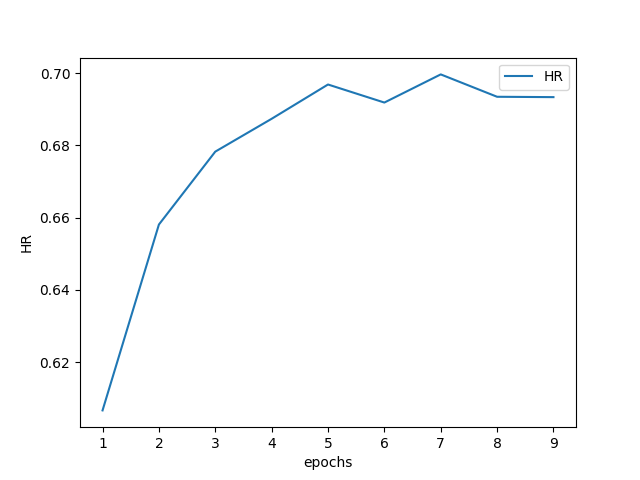
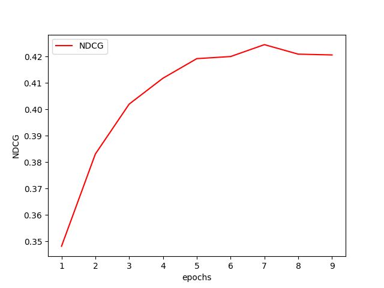

# Neural Collaborative Filtering

This repository is pytorch reimplementation of [author's code](https://github.com/hexiangnan/neural_collaborative_filtering) which is implemented using keras and theano.

You can check the paper through this [link](https://www.comp.nus.edu.sg/~xiangnan/papers/ncf.pdf).

I used author's preprocessed dataset.

## Experiment
I only checked the performance of NeuMF model without pre-training on ml-1m dataset. The hyperparmeters were set as the following.

| hyperparameter        | value           |  |
| ------------- |:--------:| ------:|
| number of epochs | 9 | --epochs | 
| batch size | 256 | --batch_size |
| dimmension of gmf vector | 4 | --num_factors |
| dimmensions of mlp hidden layers | [64,64,32,16] | --layers |
| number of negative instances to pair with a positive instance | 4 | --num_neg |
| fixed learning rate | 5e-05 | --lr |

The best performance was as below. These are almost same with what paper showed.
| Movielens HR  | Movielens NDCG |
| ------------- |:--------:|
| 0.6997        | 0.4245 |

## Requirements
- numpy (1.19.0)
- scipy (1.5.1)
- torch (1.5.1)

## Todo
- implement MLP and GMF models respectively
- add more experiments on varioust settings. (different datasets, different hyperparmeters)
